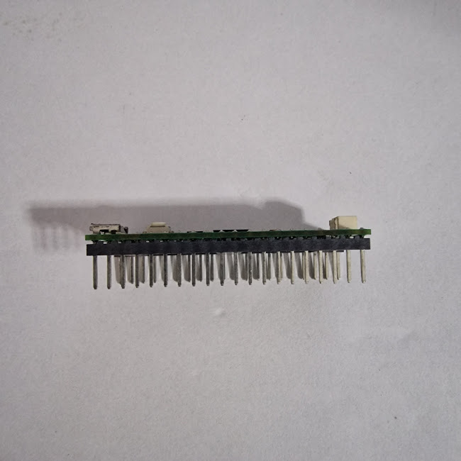
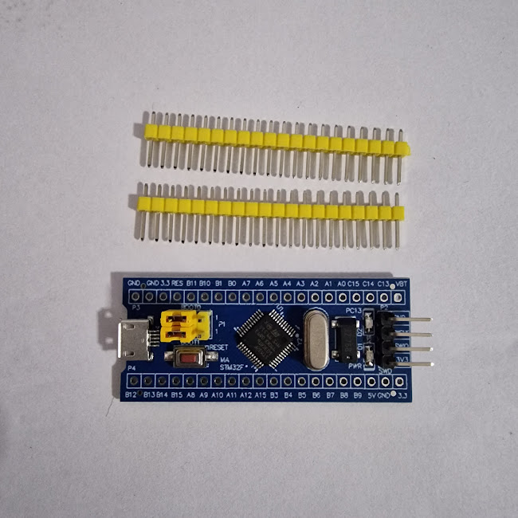

# Raspberry Pi Pico: Introdução

## 1. O que é uma Raspberry Pi Pico?

A **Raspberry Pi Pico** é uma placa microcontroladora desenvolvida [Raspberry Pi Foundation](https://www.raspberrypi.com/), ou fundação Raspberry Pi - uma organização sem fins lucrativos fundada em 2009, na Inglaterra, com o principal objetivo de estimular a ciência da computação e eletrônica com dispositivos de alta performance e baixo custo.

## 2. O que é um microcontrolador?

Um microcontrolador (ou MCU) é um pequeno computador composto por um circuito integrado, com o objetivo de trabalhar em sistemas embarcados, diferentes dos computadores pessoais. Na imagem abaixo, é possível observar uma placa da própria Raspberry Pi Pico, como exemplo.

Um microcontrolador comum contém os seguintes componentes:

- Processador (GPU): Responsável por executar os comandos, como um cérebro da placa.
- Memória RAM: Responsável por armazenar dados temporários do programa.
- Memória Flash: Responsável por guardar o código e dados permanentes.
- Entrada e saída: Periféricos que podem ser conectador aos pinos para entrada e saída de dados.

Existem uma variedades de microcontroladores, desenvolvidos por diferentes empresas ou organizações. Os principais deles são:

- ESP32
- Arduíno
- STM32
- Raspberry Pi Pico

Cada um desses microcontroladores citados, tem suas variantes. Algumas mais potentes, outras mais econômicas, a depender da necessidade e objetivo do desenvolvedor.

## 3. Qual a função da Raspberry Pi Pico?

Assim como outros microcontroladores, a Raspberry Pi Pico está na área de sistemas embarcados. No cotidiano, esse tipo de equipamento está presente em grande parte dos eletrônicos ao seu redor, como eletrodomésticos, sistemas eletrônicos de veículos, projetos de automação residencial e industrial ou até em brinquedos ou dispositivos mais simples.

## 4. Onde eu posso comprar um microcontrolador ou uma Raspberry Pi Pico?

É bem fácil de você achar esse tipo de dispositivo em sites, como Shopee, AliExpress ou MercadoLivre, mas também tem lojas especializadas em eletrônicos, como a TiggerComp, RoboCore, entre outras.

Minha experiência pessoal foi comprar uma ESP32 e algumas STM32 pela Shopee, além de uma Raspberry Pi Pico em um evento presencial, num espaço da RoboCore. Para todos esses casos, nunca tive problema.

Para quem não tem familiaridade com eletrônica ou solda de componentes, recomendo comprar uma placa já com os pinos soldados, pois algumas delas vêm com os pinos soltos. Veja as imagens abaixo, como exemplo:

## 5. Ainda não tenho uma Raspberry Pi Pico, como posso praticar?

Existem alguns sites e softwares para simular os projetos antes de montá-los com os componentes e o microcontrolador. Para esse tutorial, vou utilizar o site [Wokwi](https://wokwi.com/) que permite o usuário trabalhar com diversos tipos de microcontrolador.

## 6. Como eu programo uma Raspberry Pi Pico?

Existem alguns métodos para começar a programar, mas nesse tutorial, vamos trabalhar com o MicroPython, uma versão adaptada do Python3 para microcontroladores.

Quanto ao ambiente de desenvolvimento, existem diversas possibilidades, mas aqui, recomendarei o software [**Thonny**](https://thonny.org/) e o [**VS Code**](https://code.visualstudio.com/), com a extensão MicroPico.

## 7. Qual a diferença das Raspberry Pi Pico?

Até a documentação desse projeto, a Raspberry Pi Foundation desenvolveu quatro microcontroladores, são eles:

- [Raspberry Pi Pico](https://www.raspberrypi.com/products/raspberry-pi-pico/)
- Raspberry Pi Pico W
- [Raspberry Pi Pico 2](https://www.raspberrypi.com/products/raspberry-pi-pico-2/)
- [Raspberry Pi Pico 2 W](https://www.raspberrypi.com/products/raspberry-pi-zero-2-w/)

As principais diferenças são que os microcontroladores com a terminação **W** possuem um módulo integrado para conexão Wireless (sem fio, seja Wi-Fi ou Bluetooth). O Pico 2 possui maior capacidade de memória RAM e Flash, além de ter um processador mais potente e moderno.